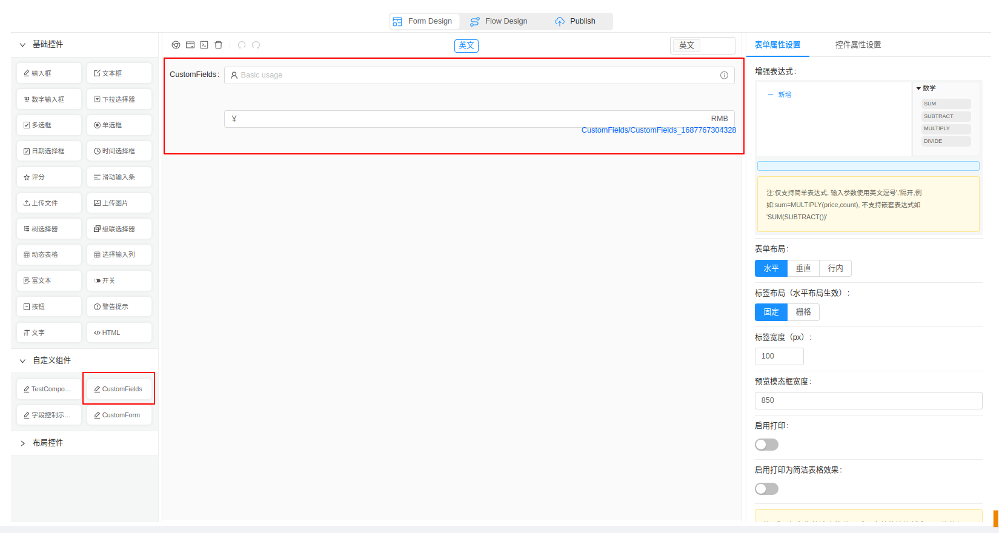
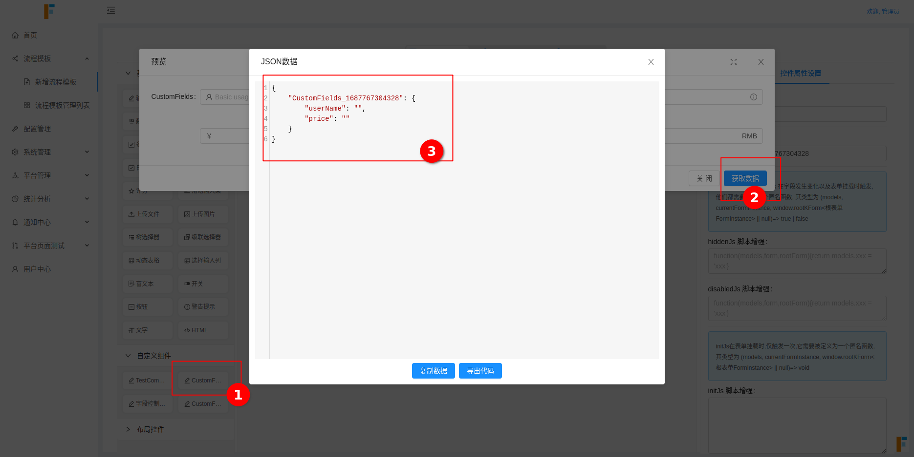

# 自定义组件 - 普通字段录入组件


## 定义普通字段录入组件示例

### step1: 创建自定义组件目录和文件

```bash
mkdir src/CusComponents4FormDesign/CustomFields
touch src/CusComponents4FormDesign/CustomFields/CustomFields.vue index.js
```

### step2: 导出和引入 组件


```js
// src/CusComponents4FormDesign/CustomFields/index.js 导入并包装
import CustomFields from './CustomFields.vue';
export default {
  label: 'CustomFields', // 标题文字
  icon: 'icon-write',
  component: CustomFields,
  type: 'CustomFields',
  options: {
    defaultValue: undefined
  },
};
```

> 导出字段详见 [自定义组件导出字段说明](/Developer/CustomCompExportConfig/)

```js
// src/CusComponents4FormDesign/index.js 导入到出口文件，并统一导出
import CustomFields from './CustomFields';
const cusComps = [];

cusComps.push(CustomFields);

export default cusComps;
```


### step3: 开发并测试 自定义组件

**对于实际的自定义组件， 默认的将会有 `value` 和 `disabled` 两个 props 值。 所有的组件需要满足 能够被 `v-model` 指令绑定。** 
**组件的默认传入值为 `value`， 默认的传出事件名为 `change`。**
**对于需要在流程结点控制权限的自定义字段， 你必须定义 `data.exposeFields` 对象**， 这个对象中， 有三个属性：

1. `value` : 字段绑定值
2. `disabled` ： 字段是否可编辑
3. `hidden` ： 字段是否可见

你需要分别监听 value, 和 exposeFields, 去触发初始值 set， 以及字段值变化，更新传出值逻辑。 


```vue
// src/CusComponents4FormDesign/CustomFields/CustomFields.vue
<template>
  <div class="components-input-demo-presuffix">
    <a-input
      ref="userNameInput"
      v-model="exposeFields.userName.value"
      v-if="!exposeFields.userName.hidden"
      :disabled="disabled || exposeFields.userName.disabled"
      placeholder="Basic usage"
    >
      <a-icon slot="prefix" type="user" />
      <a-tooltip slot="suffix" title="Extra information">
        <a-icon type="info-circle" style="color: rgba(0, 0, 0, 0.45)" />
      </a-tooltip>
    </a-input>
    <br />
    <br />
    <a-input
      v-model="exposeFields.price.value"
      v-if="!exposeFields.price.hidden"
      :disabled="disabled || exposeFields.price.disabled"
      prefix="￥"
      suffix="RMB"
    />
  </div>
</template>

<script>
export default {
  name: 'exposeFields',
  props:['value','disabled'],
  data() {
    return {
      name: 'CustomFields',
      exposeFields: {
        userName: {
          value: '',
          disabled: false,
          hidden: false,
        },
        price: {
          value: '',
          disabled: false,
          hidden: false,
        },
      },
    };
  },
  watch:{
    value:{
      handler:function(){
        if(!this.value) return
        const { userName,price } = this.value
        this.exposeFields.userName.value = userName;
        this.exposeFields.price.value = price;
      },
      immediate:true,
      deep:true,
    },
    exposeFields:{
      handler:function(){
        const {userName,price} = this.exposeFields
        this.$emit("change",{userName:userName.value,price:price.value})
      },
      immediate:true,
      deep:true,
    }
  }
};
</script>

```

> 有几点值得注意:
>
> 1. set 初始值时，仅需要set exposedFields.xxx.value, 而不需要去管 hidden,和 disable, 他们是在其他地方被自动更新的
>
>    ```vue
>    value:{
>       handler:function(){
>         if(!this.value) return
>         const { userName,price } = this.value
>         this.exposeFields.userName.value = userName;
>         this.exposeFields.price.value = price;
>       },
>       immediate:true,
>       deep:true,
>     },
>    ```
>
> 2. 在向外 emit 更新值的时候， 仅需要 emit exposedFields.xxx.value, 同样不需要 hidden 和 disable, 因为这些配置将会被绑定在各个流程结点，所以这里是不需要的。 
>
>    ```vue
>    exposeFields:{
>       handler:function(){
>         const {userName,price} = this.exposeFields
>         this.$emit("change",{userName:userName.value,price:price.value})
>       },
>       immediate:true,
>       deep:true,
>     }
>    ```
>
> 3. 在向外 emit 更新值的时候， exposeFields 这个 watcher, 需要开启 immediate:true, 否则, 当组件未手动触发时，可能会没有初始值
>
> 4. 该组件的值绑定类型， 就是 emit 出去的值类型
>
> 5. `hidden` 值要对应的绑定到 各个字段的 `v-if` 指令，用于控制是否可见
>
> 6. `disabled` 值的绑定则同时需要 `props.disable || exposedFields.xxx.disable`,  因为 `prop.disable` 控制了全局表单的可编辑状态， `exposedFields.xxx.disable`则被审批结点所控制。
>
> > 这些规则在后面的自定义表单组件同样适用

这样一个自定义组件就完成了。

你可以在这里看到自定义组件:



你可以在这里看到自定义组件的 v-model 值:

