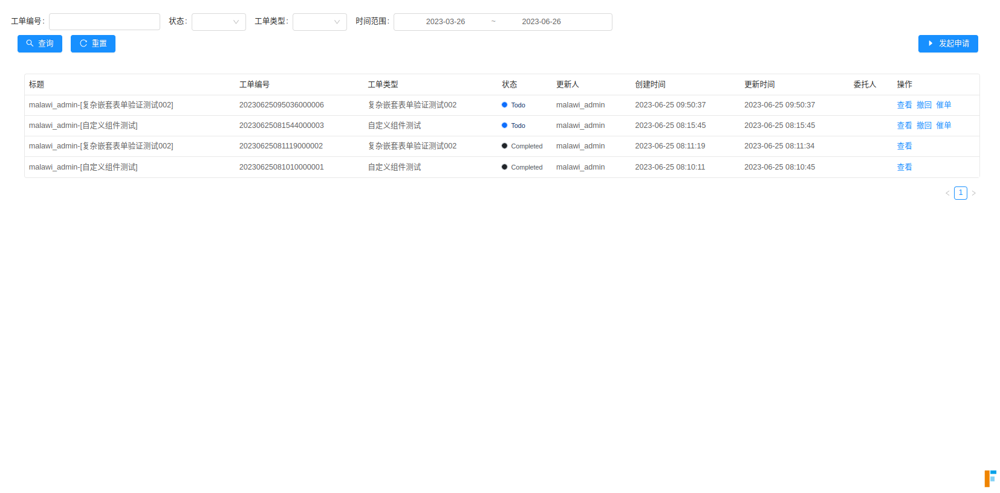

# 我的发起

1. **FLOWFORM_PLATFORM_ADDRESS**  (工单平台的部署 IP + 端口)
2. **basePath ：**  `/platform/workorder/myapply`
3. **必填参数：**
   1. `uniTenantId`
   2. `bizToken`
4. **可选参数：**
   1. `lang`
   2. `recent` : 过滤条件，number 类型，过滤时间范围默认从当前到过去几个月(默认为3)。

